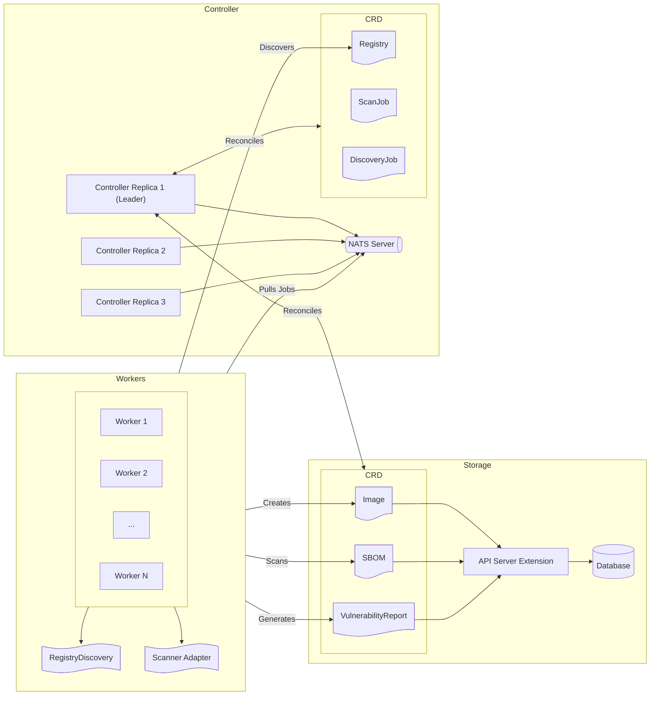

|              |                                                      |
| :----------- | :--------------------------------------------------- |
| Feature Name | Scanner architecture and design                      |
| Start Date   | Oct 24th, 2024                                       |
| Category     | Architecture                                         |
| RFC PR       | https://github.com/rancher-sandbox/sbombastic/pull/9 |
| State        | **ACCEPTED**                                         |

# Summary

[summary]: #summary

Create a SBOM-centric registry vulnerability scanner that integrates well with Rancher.

# Motivation

[motivation]: #motivation

The purpose of this RFC is to define a vulnerability scanner that scans container images and artifacts in a registry,
generates a Software Bill of Materials (SBOM), and provides vulnerability reports that include discovered CVEs and other security issues.

Another goal is to create a scanner that integrates seamlessly with Rancher,
offering an easy way to access scanner results through the Rancher UI and connect with other Rancher components, such as Kubewarden and SUSE Observability.

## Examples / User Stories

[examples]: #examples

- As a user, I want to scan all the images in my registry/repository for vulnerabilities.
- As a user, I want to see the vulnerabilities found in my images in the Rancher UI.
- As a user, I want to know which layers of my images are affected by the vulnerabilities.

Examples of user stories that can be achieved with the integration with other Rancher components:

- As a user, I want to deploy/write Kubewarden policies based on the vulnerabilities found in my images.
- As a user, I want to see the vulnerabilities found in my container images in the SUSE Observability dashboard.

# Detailed design

[design]: #detailed-design

## Processes

We define two main operations:

- the "discovery operation", as the process of cataloging all the images in a registry/repository, retrieving the image metadata and layers, and generating a SBOM.
- the "scan operation", as the process of scanning the images for vulnerabilities, generating a vulnerability report containing the discovered CVE and other security issues.

Discovery and scan operations can be triggered by the user or by a schedule.

## CRD

The following CRDs will be added to the cluster. Please note that the detailed definition of the CRDs is outside of the context of this RFC.

### Registry

Registry represents a registry to be scanned. It contains the registry URL, the name of the secret containing auth credentials, the repositories to be scanned, and the discovery and scan schedules.

```yaml
apiVersion: scanner.rancher.io/v1alpha1
kind: Registry
metadata:
  name: registry-example
  namespace: default
spec:
  url: "https://registry-1.docker.io"
  type: "docker" # registry type, e.g., docker, GCR, ECR, etc...
  auth:
    secretName: "registry-secret" # secret name used for authentication
  discoveryPeriod: "1h" # discovery new images every 1 hour
  scanPeriod: "1d" # scan images every day
  repositories: # optional, if not specified, scan all repositories
    - "repo1"
    - "repo2"
```

### Image

`Image` represents an image to be scanned. It contains the layers of the image.
Labels are used to select the image by the registry, repository, and tag.

```yaml
apiVersion: scanner.rancher.io/v1alpha1
kind: Image
metadata:
  name: "uuid"
  namespace: default
  labels:
    "scanner.rancher.io/image": "nginx:v1.19.0" # tag of the image
    "scanner.rancher.io/digest": "sha256:example" # digest of the image
    "scanner.rancher.io/registry": "registry-example" # registry name
    "scanner.rancher.io/registry-namespace": "default" # registry namespace
    "scanner.rancher.io/repository": "prod" # repository name
spec:
  layers:
    - ...
    # list of the image layers
```

### SBOM

`SBOM` represents a Software Bill of Materials of an image.

```yaml
apiVersion: canner.rancher.io/v1alpha1
kind: SBOM
metadata:
  name: "uuid" # uuid of the image
  namespace: default
  labels:
    "scanner.rancher.io/image": "nginx:v1.19.0" # tag of the image
    "scanner.rancher.io/digest": "sha256:example" # digest of the image
    "scanner.rancher.io/registry": "registry-example" # registry name
    "scanner.rancher.io/registry-namespace": "default" # registry namespace
    "scanner.rancher.io/repository": "prod" # repository name
spec:
  sbom:
    # the SBOM content in json SPDX format
```

### VulnerabilityReport

The `VulnerabilityReport` CRD represents the vulnerabilities found in an image.
The content of the report is in [SARIF](https://sarifweb.azurewebsites.net/) format, which is a standard format for the output of static analysis tools
and it is approved as an [OASIS](https://www.oasis-open.org/) standard.

```yaml
apiVersion: scanner.rancher.io/v1alpha1
kind: VulnerabilityReport
metadata:
  name: "uuid" # uuid of the image
  namespace: default
  labels:
    "scanner.rancher.io/image": "nginx:v1.19.0" # tag of the image
    "scanner.rancher.io/digest": "sha256:example" # digest of the image
    "scanner.rancher.io/registry": "registry-example" # registry name
    "scanner.rancher.io/registry-namespace": "default" # registry namespace
    "scanner.rancher.io/repository": "prod" # repository name
spec:
  report:
    # vulnerabilities found in the image in SARIF format
```

### DiscoveryJob

A DiscoveryJob represents a discovery operation that can be triggered by the user or by a schedule.
It tracks the status condition of the discovery operation.

```yaml
apiVersion: scanner.rancher.io/v1alpha1
kind: DiscoveryJob
metadata:
  name: discovery-job-example
  namespace: default
spec:
  registry: registry-example # registry name
status:
  conditions:
    - type: "Progressing"
      status: "True"
      reason: "Finished"
      ...
    - type: "Completed"
      status: "True"
      reason: "Succeeded"
      ...
```

### ScanJob

A `ScanJob` represents a scan operation that can be triggered by the user or by a schedule.
It tracks the status condition of the scan operation.

```yaml
apiVersion: scanner.rancher.io/v1alpha1
kind: ScanJob
metadata:
  name: scan-job-example
  namespace: default
spec:
  registry: registry-example # registry name
status:
  conditions:
    - type: "Progressing"
      status: "True"
      reason: "Finished"
      ...
    - type: "Completed"
      status: "True"
      reason: "Succeeded"
      ...
```

## Components

The scanner is composed of three main components:

- Worker: one or more workers that are responsible for cataloging the registry, generating the SBOM, and scanning the images.
- Storage: an API server extension that stores SBOMs and vulnerability reports in a database, to avoid using Etcd as a storage backend.

### Controller

The controller is a Kubernetes controller responsible for reconciling the scanner's CRDs and initiating the discovery of the registry, as well as scanning the images.
It will manage the scheduling of recurring discovery and scan operations as specified in the CRD, along with handling user-initiated scan and discovery requests.

The controller will use a worker queue to communicate with the workers.
We decided to use [NATS](https://nats.io/) as the message broker.
NATS can be embedded in the controller, making it easier to deploy and manage, this means that the controller should run with at least 3 replicas to ensure high availability.
The user will have the option to use an external NATS server if needed.
This setup enables the creation of atomic jobs, such as generating the SBOM for a single image or scanning an individual image, while allowing for the independent scaling of workers apart from the controller.
An alternative to NATS would be to use Kubernetes Jobs; however, running one Pod per job can be costly and inefficient.

### Worker

The worker is responsible for cataloging the registry, generating the SBOMs, and scanning the images.
Multiple workers can be deployed to scale the discovery and scan operations.
This allows Kubernetes to automatically scale the worker pool to match demand, using mechanism such as [Horizontal Pod Autoscaling](https://kubernetes.io/docs/tasks/run-application/horizontal-pod-autoscale/).

Workers pull jobs from the NATS queue and process them.
After completing a job, the worker will create or update the related CRD with the results.

The cataloging process will be implemented using the [go-containerregistry](https://github.com/google/go-containerregistry) library,
which is a Go library that provides a high-level API to interact with container registries.
The image metadata and layers will be stored in the `Image` CRD.

The SBOM generation and the scan process will be implemented by using the adapter pattern, allowing the worker to be configured to use different scanners.
For the first implementation, we will use [Trivy](https://github.com/aquasecurity/trivy) as both the SBOM generator and the scanner.
Trivy can be used as a library directly in the worker, avoiding the need to spawn a new process for each scan.
As a future improvement, we can implement other adapters to use different scanners, such as [Grype](https://github.com/anchore/grype) and [Clair](https://github.com/quay/clair).

We rely on SBOMs as the primary source of truth for the CVE scanner, as they enable caching of the image inventory,
eliminating the need to retrieve the image from the registry each time a scan is initiated.
This approach also allows us to deduplicate images with identical SHA256 hashes but different tags.
A different scanner, such as the secret scanner, may need to pull the image from the registry.
However, this analysis is performed only once when the image is created.

Another type of optimization is to verify if the CVE database contains relevant updates for the vulnerabilities associated with the image’s dependencies,
as determined from the SBOM analysis, before proceeding with the scan.
For instance, when the vulnerability database is updated with new vulnerabilities for Alpine Linux, the scanner will target only the SBOMs of images that are based on Alpine Linux.

### Storage

The storage is responsible for extending the Kubernetes API server to store SBOMs and vulnerability reports in a database.
This is needed to avoid using Etcd as a storage backend, as it is not designed to store large amounts of data.
Please refer to the [Kubernetes Extension API server] (https://kubernetes.io/docs/tasks/extend-kubernetes/setup-extension-api-server/) documentation for more information.

The storage will expose the `SBOM` and `VulnerabilityReport` CRDs to the other components and the user.
Utilizing CRDs will facilitate easier integration with other Rancher components.
For instance, the Rancher UI can transparently retrieve the SBOM and vulnerability reports from storage as they function like standard CRDs.
In Kubewarden, policies that utilize [context-aware](https://docs.kubewarden.io/explanations/context-aware-policies) calls will have the ability to access the vulnerabilities associated with an image.

It will be possible to use different database adapters such as MySQL, PostgreSQL, or SQLite.
The user will be able to configure the database connection in the storage helm chart.

The storage will also serve as a deduplication layer by utilizing the same data for SBOMs, vulnerability reports, and image data associated with the same image sha256 hash.
However, users will still see distinct resources, as the deduplication process will be managed internally, allowing consumers of the data to remain unaware of it.

### Helm Chart

A Helm chart will be provided to deploy the scanner components.

## Operational Flow

1. The user creates a `Registry` resource to define the registry designated for scanning.
2. The controller submits a request for a discovery job to the worker queue.
3. A worker pulls the discovery job and initiates the discovery process.
4. The worker generates `Image` resources for each image identified in the registry.
5. The `Image` reconciler receives the `Image` resources and issues a request to generate the SBOM to the worker queue.
6. A worker pulls the SBOM generation job and commences the generation process.
7. The worker produces the SBOM and stores it in the `SBOM` resource.
8. The `SBOM` reconciler receives the `SBOM` resources and issues a scan job to the worker queue.
9. A worker pulls the scan job and begins the scanning process.
10. The worker generates the vulnerability report and stores it in the `VulnerabilityReport` resource.

The discovery process and scan process are scheduled by the controller based on the `discoveryPeriod` and `scanPeriod` fields specified in the `Registry` resource.
Moreover, users have the option to manually trigger discovery and scan operations by creating a `DiscoveryJob` or a `ScanJob` resource.

### Multi-tenancy

All the CRDs will be namespaced to enable multi-tenancy support.
The controller will manage multiple registries across various namespaces.
The scan results will be stored within the same namespace as the associated registry.

# Architectural Diagram



# Drawbacks

[drawbacks]: #drawbacks

<!---
Why should we **not** do this?

  * obscure corner cases
  * will it impact performance?
  * what other parts of the product will be affected?
  * will the solution be hard to maintain in the future?
--->

# Alternatives

[alternatives]: #alternatives

Currently, there is no registry vulnerability scanner that it is tailored to the Rancher ecosystem.
Few options exist, but they are focused on the whole cluster, including nodes vulnerability and compliance, and they don't provide
registry discovery capabilities.
Also, most of the existing scanners double as policy enforcers, overlapping with [Kubewarden](https://kubewarden.io/).

A few notable alternatives are:

- [Trivy Operator](https://github.com/aquasecurity/trivy-operator)
- [KubeScape](https://github.com/kubescape/kubescape)
- [Harbor](https://github.com/kubescape/kubescape)

# Unresolved questions

[unresolved]: #unresolved-questions

<!---
- What are the unknowns?
- What can happen if Murphy's law holds true?
--->

```

```

```

```
